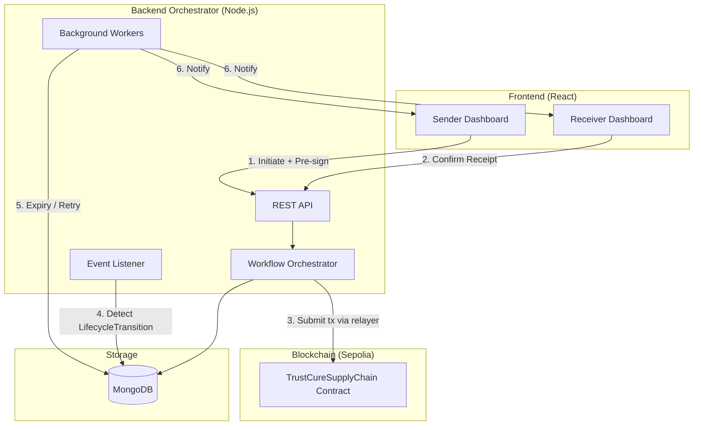
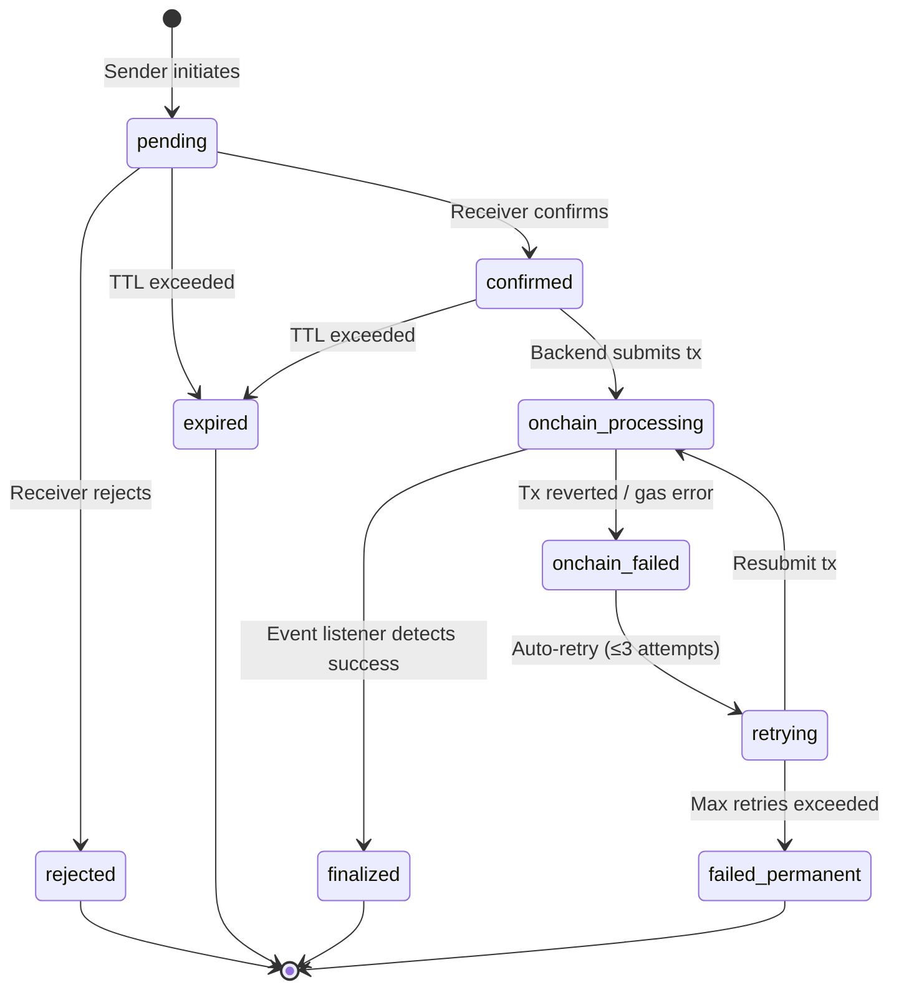

# Refined Custody Transfer Architecture

The smart contract `transferCustody()` is atomic. The two-step confirmation layer lives off-chain. This plan incorporates 8 architectural improvements while keeping the contract unchanged.

---

## 1. Architecture Overview — Hybrid State Management



**Responsibility separation:**

| Layer | Role |
|-------|------|
| **Frontend** | User intent capture, signature collection, state display |
| **Backend API** | Validation, workflow orchestration, transfer lifecycle |
| **Background Workers** | Expiry cleanup, retry failed txs, notifications |
| **Event Listener** | Blockchain → DB sync (source of truth reconciliation) |
| **Blockchain** | Final authority for ownership and stage |

---

## 2. Transfer State Machine



**States:**
- `pending` — Sender initiated, awaiting receiver
- `confirmed` — Receiver confirmed, awaiting on-chain settlement
- `rejected` — Receiver declined
- `expired` — TTL exceeded (configurable, default 24h)
- `onchain_processing` — Tx submitted, awaiting confirmation
- `onchain_failed` — Tx reverted or gas error
- `retrying` — Auto-retry in progress (max 3 attempts)
- `failed_permanent` — All retries exhausted, requires manual resolution
- `finalized` — Event listener confirmed on-chain success

---

## 3. Pre-Signed Authorization (Remove Sender Online Dependency)

The sender pre-signs the transfer intent at initiation time. The backend submits the on-chain tx after receiver confirmation using the sender's private key signature.

**However**, `transferCustody()` requires `msg.sender == ownerOf(tokenId)` — a relayer pattern won't work without contract modification.

> [!IMPORTANT]
> **Practical solution for the existing contract**: The sender **pre-approves** the transfer by storing intent. When both parties agree, the backend notifies the sender's frontend via WebSocket to auto-execute the tx. If sender is offline, the transfer stays in `confirmed` state until sender reconnects, at which point the frontend auto-submits.
>
> This achieves near-immediate settlement when sender is online, and graceful degradation when offline — no contract changes required.

**Implementation:**
- Store `senderSignature` (EIP-712 typed data) in Transfer record for audit proof
- WebSocket push to sender on receiver confirmation
- Frontend auto-executes `transferCustody()` on reconnect if pending `confirmed` transfers exist
- Fallback: sender gets email/notification to manually finalize

---

## 4. Finalization-Time Revalidation

Before submitting the on-chain tx, the backend re-verifies:

```javascript
// In workflow orchestrator, before tx submission
async validateForFinalization(transfer) {
    const product = await Product.findOne({ tokenId: transfer.tokenId });
    
    // 1. Owner hasn't changed
    if (product.currentOwner !== transfer.fromWallet) 
        throw new Error('OWNER_CHANGED');
    
    // 2. Stage hasn't advanced
    if (product.currentStage !== transfer.currentStage) 
        throw new Error('STAGE_MISMATCH');
    
    // 3. Product not locked
    if (product.currentStage === 'Sold') 
        throw new Error('PRODUCT_FROZEN');
    
    // 4. No other finalized transfer exists
    const conflict = await Transfer.findOne({
        tokenId: transfer.tokenId,
        status: { $in: ['onchain_processing', 'finalized'] },
        _id: { $ne: transfer._id }
    });
    if (conflict) throw new Error('CONFLICT_TRANSFER');
}
```

---

## 5. Failure Handling & Retry Logic

```javascript
const RETRY_CONFIG = {
    maxAttempts: 3,
    backoffMs: [5000, 15000, 45000], // Exponential backoff
    retryableErrors: ['NONCE_TOO_LOW', 'REPLACEMENT_UNDERPRICED', 
                      'INSUFFICIENT_FUNDS', 'TIMEOUT']
};
```

On failure:
1. Classify error as retryable vs permanent
2. If retryable → increment `retryCount`, set status to `retrying`, schedule next attempt
3. If permanent (revert, invalid state) → set `failed_permanent`, restore product status, notify both parties
4. Log all attempts in `transfer.txAttempts[]` array for audit

---

## 6. Transfer Expiry & Cleanup

**Background worker** (runs every 5 minutes via `setInterval`):

```javascript
// Expire stale pending transfers (24h default)
await Transfer.updateMany(
    { status: 'pending', initiatedAt: { $lt: dayAgo } },
    { $set: { status: 'expired' } }
);

// Expire unfinalized confirmed transfers (1h)
await Transfer.updateMany(
    { status: 'confirmed', confirmedAt: { $lt: hourAgo } },
    { $set: { status: 'expired' } }
);

// Restore product transferStatus for expired transfers
for (const t of expiredTransfers) {
    await Product.updateOne(
        { tokenId: t.tokenId }, 
        { transferStatus: 'none', pendingTransferId: null }
    );
    // Notify both parties via WebSocket
}
```

---

## 7. Event-Driven On-Chain Sync (Replace Frontend-Driven Finalization)

Extend the existing [eventListener.js](file:///e:/TrustCure1/backend/services/eventListener.js) polling service:

```javascript
// In poll() method, add LifecycleTransition handler:
const transitions = await this.supplyChainContract.queryFilter(
    'LifecycleTransition', fromBlock, toBlock
);

for (const event of transitions) {
    const { tokenId, from, to, stage } = event.args;
    const txHash = event.transactionHash;
    
    // Find matching pending transfer
    const transfer = await Transfer.findOne({
        tokenId: Number(tokenId),
        fromWallet: from.toLowerCase(),
        toWallet: to.toLowerCase(),
        status: { $in: ['onchain_processing', 'confirmed'] }
    });
    
    if (transfer) {
        transfer.status = 'finalized';
        transfer.txHash = txHash;
        transfer.finalizedAt = new Date();
        await transfer.save();
    }
    
    // Update Product regardless (blockchain is source of truth)
    await Product.findOneAndUpdate(
        { tokenId: Number(tokenId) },
        { currentStage: stageMap[Number(stage)],
          currentOwner: to.toLowerCase(),
          transferStatus: 'none',
          pendingTransferId: null }
    );
}
```

> [!TIP]
> This guarantees that even if the frontend crashes mid-finalization, the backend will eventually reconcile from on-chain events.

---

## 8. Concurrency & Replay Protection

| Protection | Mechanism |
|-----------|-----------|
| One active transfer per product | Unique partial index: `{ tokenId: 1 }` where `status ∈ [pending, confirmed, onchain_processing]` |
| Idempotent finalize | Check `transfer.status !== 'finalized'` before processing; txHash uniqueness index |
| No duplicate confirmations | Atomic `findOneAndUpdate` with `status: 'pending'` filter |
| Replay protection | EIP-712 signature includes `nonce` (transfer `_id`) and `deadline` timestamp |

---

## 9. Enhanced UX States

| Backend Status | UI Label | Badge Color | Icon |
|---------------|----------|-------------|------|
| `pending` | Awaiting Receiver | Amber | Clock |
| `confirmed` | Awaiting Settlement | Blue | Loader |
| `onchain_processing` | Processing On-Chain | Indigo (pulse) | Chain |
| `onchain_failed` | Settlement Failed | Red | AlertTriangle |
| `retrying` | Retrying... | Orange (pulse) | RefreshCw |
| `finalized` | Transfer Complete | Green | CheckCircle |
| `rejected` | Transfer Declined | Red | XCircle |
| `expired` | Transfer Expired | Gray | Clock |

Real-time updates via existing WebSocket (`socket.io`):
- `transfer:status_changed` → push to sender + receiver rooms
- Dashboard badge count for pending incoming transfers

---

## Proposed File Changes

### Backend

| Action | File | Summary |
|--------|------|---------|
| **NEW** | `models/Transfer.js` | Transfer model with full state machine |
| **MODIFY** | [models/Product.js](file:///e:/TrustCure1/backend/models/Product.js) | Add `transferStatus` + `pendingTransferId` |
| **MODIFY** | [routes/api.js](file:///e:/TrustCure1/backend/routes/api.js) | Add 6 transfer endpoints |
| **MODIFY** | [services/eventListener.js](file:///e:/TrustCure1/backend/services/eventListener.js) | Add `LifecycleTransition` event handler |
| **NEW** | `services/transferWorker.js` | Background expiry + retry worker |

### Frontend

| Action | File | Summary |
|--------|------|---------|
| **NEW** | `components/TransferModal.jsx` | Sender-facing transfer initiation modal |
| **NEW** | `components/IncomingTransfers.jsx` | Receiver-facing incoming transfers panel |
| **NEW** | `hooks/useTransferCustody.js` | On-chain tx execution hook |
| **MODIFY** | [pages/Dashboard.jsx](file:///e:/TrustCure1/frontend/src/pages/Dashboard.jsx) | Integrate transfer UX into dashboard |

---

## Verification Plan

### Automated Tests
1. Start backend → verify transfer worker runs without errors
2. Create transfer via API → verify product `transferStatus` updates
3. Confirm transfer → verify WebSocket notification fires
4. Simulate tx failure → verify retry logic and state transitions

### Manual Verification
1. Manufacturer creates product → transfers to Distributor → verify pending state
2. Distributor confirms → verify on-chain tx executes → verify finalized state
3. Test rejection flow → verify product returns to normal
4. Test expiry → wait for timeout → verify auto-cleanup
5. Test offline sender → verify transfer stays in `confirmed` until sender reconnects
